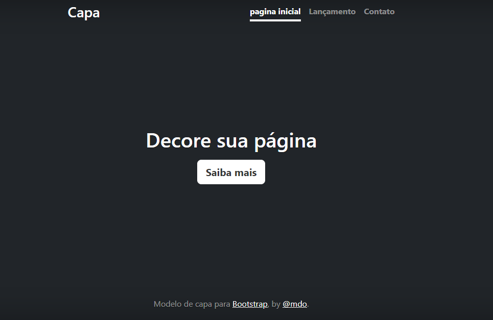

# ÍNDICE
°[PORTIFÓLIO PESSOAL](#portif%C3%B3lio-pessoal)  
°[Descrição](#descri%C3%A7%C3%A3o)  
°[Introdução](#introdu%C3%A7%C3%A3o)  
°[Funcionalidades](#funcionalidades)  
°[Tecnologias Utilizadas](#tecnologias-utilizadas)  
°[Fontes Consultadas](#fontes-consultadas)  
°[Autores](#autores)  

# PORTIFÓLIO PESSOAL

    Projeto criado utilizando exemplo do Bootstrap para ensino de uso do README e do Bootstrap

## Descrição

    O Portifólio Pessoal é um projeto realizado em sala de aula com a intenção de melhorar o desenvolvimento dos alunos ao fazer o arquivo README. O projeto teve auxiliação do Bootstrap para a página inicial, tanto o CSS quanto HTML.

    
## Introdução

## Funcionalidades

### Tecnologias utilizadas

HTML, CSS, VSCODE, Bootstrap, GitHub, Git

## Fontes Consultadas

https://gist.github.com/lohhans/f8da0b147550df3f96914d3797e9fb89

https://www.alura.com.br/artigos/escrever-bom-readme

## Autores

Maria Eduarda Mendes e Layla Beatrice